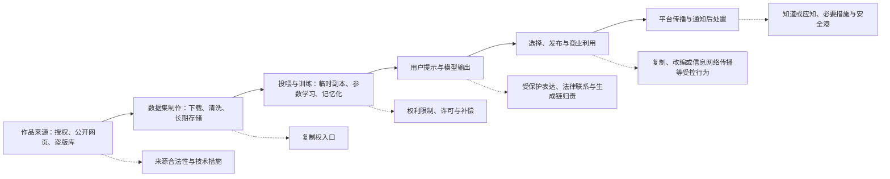

# AIGC 版权责任链总图｜训练、输出与平台

> [!abstract] 总命题
> AIGC 版权问题不是一个“AI 是否侵权”的大问题，而是四个前后相接、规范基础不同的问题：**输出能否成为作品—训练时能否使用既有作品—具体输出是否侵犯既有作品—服务提供者是否因自身行为或未尽义务承担责任。**

## 1. 四个专题的边界｜No-Overlap Topic Architecture

| 日次与主题 | 本页只回答什么 | 本页不回答什么 | 与下一页的交接点 |
|---|---|---|---|
| [[知识产权/研究工作台/七大专题/Daily IP Jurisprudence & English Corpus/Day 01 - AIGC作品性：客观结果还是人类创作过程\|Day 01：AIGC 作品性]] | 输出中是否存在可归因于自然人的独创表达；谁可能是作者 | 训练数据是否合法；输出是否抄袭他人；平台是否免责 | “输出是作品”与“输出侵权”互不推出 |
| [[知识产权/研究工作台/七大专题/Daily IP Jurisprudence & English Corpus/Day 02 - 训练数据的版权入口与制度出口\|Day 02：训练数据]] | 数据取得、数据集制作、投喂与训练是否进入复制权；如进入，何种例外或许可可使其合法 | 某次输出是否实质性相似；传播平台的通知义务 | 输入合法不保证输出合法；输入违法也不使每次输出当然侵权 |
| [[知识产权/研究工作台/七大专题/Daily IP Jurisprudence & English Corpus/Day 03 - AIGC输出侵权与生成链归责\|Day 03：输出侵权]] | 具体输出是否利用受保护表达；用户、模型商、微调者、API 接入商分别实施了什么行为 | 传统 UGC 平台是否满足安全港条件 | 先成立基础侵权或可归责风险，才有平台二级责任问题 |
| [[知识产权/研究工作台/七大专题/Daily IP Jurisprudence & English Corpus/Day 04 - 安全港的功能性改造：具体知情、目标过滤与程序保障\|Day 04：安全港]] | 平台何时知道或应知；通知后采取何种必要措施；目标过滤何时越界为普遍监控 | 重新判断作品性、训练合理使用或输出实质性相似 | 安全港是责任限制机制，不是作品、侵权或因果关系的替代判断 |

### 一句话分工｜One Question per Topic

- **Day 01 — Entitlement:** Is there a copyrightable human work?
- **Day 02 — Input Legality:** Was the pre-existing work lawfully used in training?
- **Day 03 — Output Liability:** Does a particular output appropriate protected expression, and who is responsible for its generation or exploitation?
- **Day 04 — Intermediary Governance:** When must a service provider intervene, and what measures are proportionate?

## 2. 统一责任链｜The Unified Liability Chain

### 五条交接规则｜Handoff Rules

1. **技术过程与法律行为分开。**参数学习、缓存、输出和传播是技术事实；是否构成复制、改编或信息网络传播，必须分别对照法定专有权。
2. **训练与输出分别评价。**训练阶段的复制不自动证明输出复制；输出没有实质性相似也不能倒推训练当然合法。
3. **直接侵权先于二级责任。**先问谁实施了受控行为，再问谁提供实质帮助并具有过错；不满足免责条件不等于当然侵权。
4. **公法义务不直接等于私法赔偿。**监管规范可提供注意义务线索，但仍须审查规范保护目的、行为、损害、因果关系和可归责性。
5. **救济针对可证明的风险。**删除单个输出、阻断传播、拦截特定提示、去重、防止稳定复现和修改模型的强度不同，必须受技术可行性、成本、误伤和比例原则约束。

## 3. 共通法哲学底座｜Shared Jurisprudential Foundations

这些知识点只在总图集中说明；后续三页只处理各自新增问题。

| 共通原则 | 法哲学含义 | English formulation |
|---|---|---|
| 法定权利原则 | 著作权不是对作品一切价值的绝对支配，而是若干法定专有权控制特定行为 | copyright as a bundle of statutorily defined exclusive rights |
| 思想／表达二分 | 防止对风格、主题、事实、方法和创作规律的私有化，保留后续创新空间 | the idea–expression dichotomy; preservation of the expressive commons |
| 激励与获取平衡 | 排他权以社会成本换取创作和传播激励，保护越强不必然社会福利越高 | incentive–access balance; optimal rather than maximal protection |
| 阶段独立评价 | 同一技术链中，每个行为节点有不同权利入口、抗辩与责任主体 | stage-specific legal characterization |
| 控制—知识—成本 | 注意义务应与主体对具体风险的知识、控制力和低成本预防能力相匹配 | knowledge, control, and least-cost risk avoidance |
| 证据接近原则 | 掌握训练记录、模型测试和推荐机制者，应承担相称的说明或证据提出责任 | evidentiary proximity; a burden of explanation rather than automatic liability |
| 比例原则 | 措施须能降低风险，同时避免对合法表达、技术创新和竞争造成过度损害 | proportionality of remedies and safeguards against over-enforcement |
| 私法自治与交易成本 | 事前同意保护作者自治，但在海量交易中可能失灵；责任规则降低成本，却削弱排除权 | property rules versus liability rules; autonomy versus transaction costs |
| 分配正义 | 不能只计算总创新收益，还要问训练与治理成本由创作者、企业、用户和公众中的谁承担 | distributive justice and the allocation of technological externalities |

## 4. 现行法底线｜Current-Law Baseline as of 2026-08-17

1. 《著作权法》第 10 条以列举方式规定复制权、改编权、信息网络传播权等专有权；第 24 条列举无需许可、无需付酬的使用情形，并加入不得影响作品正常使用、不得不合理损害权利人合法权益的限制。现行条文没有明文设置一般性的文本与数据挖掘例外。[中国人大网：《中华人民共和国著作权法》](https://www.npc.gov.cn/c2/c30834/202011/t20201119_308796.html)
2. 《民法典》第 1195—1197 条形成“通知—必要措施—反通知／声明—知道或应知”的一般网络侵权框架。通知必须包含初步证据和真实身份信息；网络服务提供者未及时采取必要措施时，仅就损害扩大部分承担相应连带责任；知道或应知而不采取措施的，与用户承担连带责任。[中国网信网：《中华人民共和国民法典》](https://www.cac.gov.cn/2020-06/01/c_15925617772683196.htm)
3. 《信息网络传播权保护条例》第 14 条以下对信息存储空间与搜索、链接服务规定通知、删除或断链机制；第 22 条等规定特定服务的赔偿责任限制条件。该制度通常被概括为中国版权法上的“避风港”，但其适用对象和条件须依具体服务类型判断。[国家行政法规库：《信息网络传播权保护条例》](https://xzfg.moj.gov.cn/front/law/detail?LawID=167&Query=%E4%BF%A1%E6%81%AF%E5%8F%8A)
4. 《生成式人工智能服务管理暂行办法》第 7 条要求训练数据具有合法来源，涉及知识产权的不得侵害他人依法享有的知识产权；这是合规义务和风险判断的重要依据，但它没有替代《著作权法》对作品、受控行为、权利限制和民事责任的逐项审查。[中国网信网：《生成式人工智能服务管理暂行办法》](https://www.cac.gov.cn/2023-07/13/c_1690898327029107.htm?mhEnc=3d537d9731a15cfadd38e2d9f63e5491&mhType=2&pageId=1171717&publicId=3839645904b1b311ef1a85b3f3def5ca09f9&websiteId=602694&wfwfid=120336)
5. 《人工智能生成合成内容标识办法》已于 2025 年 9 月 1 日施行，要求生成与传播环节配置显式、隐式标识等措施。标识有助于识别来源和追踪责任，但“已标识”不等于不侵权，“未标识”也不自动证明版权侵权。[中国网信网：标识办法发布说明](https://www.cac.gov.cn/2025-03/14/c_1743654685899683.htm)

## 5. 王迁教程共通知识索引｜Shared Wang Qian Reading Map

| 基础知识 | 用于哪一段责任链 | 精确入口 |
|---|---|---|
| 专有权控制特定行为 | 全链条的第一判断方法 | [[法书/03王迁-知产教程-重构版/著作权法✅/04著作权的内容与利用#1.1 专有权控制特定行为\|1.1 专有权控制特定行为]] |
| 财产权的制度功能 | 理解许可报酬、创作激励与传播 | [[法书/03王迁-知产教程-重构版/著作权法✅/04著作权的内容与利用#7.1 财产权的制度功能\|7.1 财产权的制度功能]] |
| 作品成立与侵权成立分离 | 防止把“有作品”直接写成“被侵权” | [[法书/03王迁-知产教程-重构版/著作权法✅/03著作权的客体#5.1 作品成立 ≠ 侵权成立\|5.1 作品成立不等于侵权成立]] |
| 侵权比对方法 | 输出端先过滤不受保护元素，再判断实质性相似 | [[法书/03王迁-知产教程-重构版/著作权法✅/03著作权的客体#5.2 侵权比对方法\|5.2 侵权比对方法]] |
| 著作权限制的正当性 | 训练例外与平台合法表达保护的共同理论基础 | [[法书/03王迁-知产教程-重构版/著作权法✅/07对著作权的限制#1.1 著作权限制的必要性与正当性\|1.1 限制的必要性与正当性]] |
| 三步检验法 | 审查新增训练例外或扩张解释的外部边界 | [[法书/03王迁-知产教程-重构版/著作权法✅/07对著作权的限制#1.2 三步检验法（Three-Step Test）⭐⭐\|1.2 三步检验法]] |
| 直接侵权与间接侵权 | 输出责任与平台责任的体系分界 | [[法书/03王迁-知产教程-重构版/著作权法✅/08著作权侵权及法律责任#一、直接侵权与间接侵权的基本关系\|直接侵权与间接侵权的基本关系]] |
| 无一般监控义务 | 安全港及目标过滤的基线 | [[法书/03王迁-知产教程-重构版/著作权法✅/08著作权侵权及法律责任#2.2 网络服务商没有一般监控义务 ⭐⭐⭐\|2.2 无一般监控义务]] |
| 通知—移除规则 | 平台收到具体通知后的责任变化 | [[法书/03王迁-知产教程-重构版/著作权法✅/08著作权侵权及法律责任#2.3 通知-移除规则 ⭐⭐⭐\|2.3 通知—移除规则]] |
| 侵权与责任六步法 | 把作品、行为、例外、间接责任与救济按顺序书写 | [[法书/03王迁-知产教程-重构版/著作权法✅/08著作权侵权及法律责任#8.1 著作权侵权与责任六步法\|8.1 侵权与责任六步法]] |
| 功利主义、利益平衡与技术成本 | 四专题共同的制度正当性框架 | [[法书/03王迁-知产教程-重构版/著作权法✅/02著作权法律制度概述✅#3.3 功利主义学说详解 ⭐⭐⭐\|3.3 功利主义]]；[[法书/03王迁-知产教程-重构版/著作权法✅/02著作权法律制度概述✅#4.1 利益平衡机制 ⭐⭐⭐\|4.1 利益平衡]]；[[法书/03王迁-知产教程-重构版/著作权法✅/02著作权法律制度概述✅#4.2 技术发展对著作权制度的影响 ⭐⭐⭐\|4.2 技术改变成本结构]] |

## 6. 防重复速查｜Where Does a Question Belong?

| 面试问题 | 应进入的专题 | 不应混入的答案 |
|---|---|---|
| “公开网页可否直接拿来训练？” | Day 02：来源公开、取得合法与版权许可三者分开 | Day 04 的通知删除不能解决训练授权 |
| “模型参数是不是作品复制件？” | Day 02：参数是否可还原表达；与前端副本分开 | 不由 Day 03 的输出相似直接反推 |
| “AI 模仿画风是否侵权？” | Day 03：先做思想／风格与具体表达过滤 | Day 01 的作品性不决定侵权；Day 02 的训练合法性也不决定 |
| “用户和模型商谁是直接侵权人？” | Day 03：按提示、运算、选择、发布和控制能力分行为 | 不能先用“平台”标签或安全港作答 |
| “平台推荐过侵权内容是否应知？” | Day 04：推荐只是相关事实，须与具体知情、人工介入等结合 | 不重新争论该内容是否为作品 |
| “收到通知后是否必须改模型？” | Day 04：以稳定复现、通知精度、技术成本和误伤决定措施阶梯 | 不能把最重措施当作安全港的默认条件 |

## 7. 一句总立场｜Master Interview Thesis

> The central task is not to decide whether “AI” is categorically lawful or unlawful, but to disaggregate the technological lifecycle into legally distinct acts and to allocate rights, burdens of proof, and preventive duties according to protected expression, specific knowledge, actual control, and proportionate cost.

