# 非版权专题总图｜数据、竞争法、商标与商业秘密

> [!abstract] 总命题
> 这组专题的共同难题不是“新技术是否值得保护”，而是：**法律应当保护一种可对世排他的客体、一个仅在特定关系中成立的秘密，还是只禁止一种扭曲竞争过程的行为。**答题时必须先确定规范层级，再谈投入、恶意或损害。

## 1. 五日主题与去重边界

| 页面 | 唯一核心问题 | 不在本页重复处理 |
|---|---|---|
| [[知识产权/研究工作台/七大专题/Daily IP Jurisprudence & English Corpus/Day 05 - 商业数据保护：确权、控制还是行为规制\|Day 05 商业数据]] | 数据集合的经营利益应否转化为排他权，公开数据抓取何时不正当 | 一般条款的抽象适用边界、秘密信息三要件 |
| [[知识产权/研究工作台/七大专题/Daily IP Jurisprudence & English Corpus/Day 06 - 一般条款的边界：补充保护还是准知识产权\|Day 06 一般条款]] | 专门法不保护时，竞争法能否及如何补充 | 数据权属方案、商标恶意的具体法条 |
| [[知识产权/研究工作台/七大专题/Daily IP Jurisprudence & English Corpus/Day 07 - 商标法的制度轴线：注册、使用、混淆与公共领域\|Day 07 商标总结构]] | 注册公示、真实使用、消费者混淆与公共领域如何构成一个制度 | 恶意注册证据链的深入展开 |
| [[知识产权/研究工作台/七大专题/Daily IP Jurisprudence & English Corpus/Day 08 - 商标恶意注册：形式权利、真实使用与恶意行权\|Day 08 恶意注册]] | 中性申请、定向抢注、囤积和恶意行权如何分型 | 一般商标侵权全体系 |
| [[知识产权/研究工作台/七大专题/Daily IP Jurisprudence & English Corpus/Day 09 - 数字商业秘密：替代成本、合理措施与动态退出\|Day 09 数字商业秘密]] | 非公开信息、数据集合和模型参数何时构成商业秘密 | 已公开数据的通常抓取规则 |

## 2. 一张图看规范入口

```mermaid
flowchart TD
    A["争议对象：数据、模型、标志或市场行为"] --> B{"是否落入法定知识产权客体及专有权？"}
    B -->|"是"| C["先适用著作权、专利或商标法的具体构成与限制"]
    B -->|"否"| D{"信息是否具体、非公开、有商业价值且采取相应保密措施？"}
    D -->|"是"| E["商业秘密：再审获取、披露、使用及合法来源"]
    D -->|"否"| F{"是否落入数据专款或其他反不正当竞争类型？"}
    F -->|"是"| G["适用具体行为规则：来源、手段、用途、规模、替代与竞争影响"]
    F -->|"否"| H{"是否仍存在可类型化的竞争机制损害？"}
    H -->|"是"| I["审慎适用一般条款：不得抵触专门法政策"]
    H -->|"否"| J["保留在竞争自由与公共领域"]
```

### 核心顺序

`客体与权利 → 特别行为规则 → 商业秘密 → 数据专款 → 一般条款 → 竞争自由`

这里的顺序不是说商业秘密永远排在数据专款之前，而是要求先判断是否存在一个法定的、边界较明确的保护结构。案件可能并行主张，但裁判理由不得把不同制度的要件相互替代。

## 3. 四种保护结构不能混写

| 保护结构 | 正当性来源 | 原告必须说明 | 制度性限流阀 |
|---|---|---|---|
| 法定专有权 | 立法预先界定客体、内容、期限与例外 | 客体适格、权利归属、行为落入专有权 | 法定客体、权利列举、期限、例外、公共领域 |
| 商业秘密 | 对非公开信息控制边界及诚实获取秩序的保护 | 具体秘密点、秘密性、价值、措施、不当获取或使用 | 独立开发、合法反向工程、公开后退出 |
| 数据经营性利益 | 对合法投入、组织和利用形成的竞争利益予以行为性保护 | 数据粒度、来源贡献、合法持有、取用手段、实质替代 | 不当然设权、不追及合法衍生品、数据流动与用户利益 |
| 一般条款 | 维护可识别的竞争机制与消费者选择 | 具体竞争关系、可归责行为、功能性商业道德、市场损害、因果关系 | 专门法优先、类型化、比例救济、禁止单凭“搭便车” |

## 4. 交叉事实的分流规则

### 4.1 爬虫抓取

- 抓取后台或受限数据：先审商业秘密、访问权限与技术措施的功能。
- 抓取公开页面：通常进入 2025 年《反不正当竞争法》第 13 条第 3 款的数据规则；重点不是“平台说禁止”，而是获取手段、利用规模、价值增量、实质替代及竞争影响。
- 仅因违反 robots 协议或服务条款，不当然产生对世排他权；合同效力、技术规避和竞争法评价应分开。

### 4.2 模型蒸馏

- 若提取的是具体非公开参数、结构或训练诀窍：进入商业秘密。
- 若通过公开接口学习功能但未复制秘密：重点审是否属于合法竞争性学习，或是否以异常调用、规避限制和替代产品造成竞争机制损害。
- “训练成本很高”只证明利益重要，不证明秘密、权利或不正当性。

### 4.3 平台数据开放

- 数据来源者、用户、商户和平台可能分别作出贡献，不宜用单一“所有权”吞并全部利益。
- 可携权、合同访问权、竞争法开放义务和反垄断必要设施属于不同强度的制度，必须分别证明。
- 开放义务的正当性来自降低锁定和恢复竞争，不来自对平台投入的道德否定。

### 4.4 商标与竞争法

- 注册商标权先按商标法处理，未注册标识可在满足“有一定影响”和混淆等条件时进入反不正当竞争法。
- 商标法明确拒绝保护或设置使用、商品类别、混淆等限制时，不得用一般条款重建更强、无期限的标志权。
- 恶意是相关事实，不是跳过具体规范结构的万能条款。

## 5. 王迁教程：共同理论底座

> [!warning] 对应范围说明
> 王迁教材目录中没有独立的“数据权益”“反不正当竞争法一般条款”或“商业秘密法”专章。下列链接是承担理论论证的**相邻知识点**，不是声称教材已经直接解决新问题。

| 共同基础知识 | 对本组专题的意义 | 教材具体入口 |
|---|---|---|
| 劳动不当然产生专有权 | 阻止从投入、成本直接跳到数据所有权或模型权 | [[法书/03王迁-知产教程-重构版/著作权法✅/02著作权法律制度概述✅#3.1 劳动自然权学说详解\|劳动自然权学说]]、[[法书/03王迁-知产教程-重构版/著作权法✅/02著作权法律制度概述✅#劳动自然权学说的问题\|劳动学说的局限]] |
| 事实与数据不被作品权垄断 | 保护汇编的选择编排，不把其中事实数据一并私有化 | [[法书/03王迁-知产教程-重构版/著作权法✅/03著作权的客体#17.3 汇编作品的保护范围\|汇编作品的保护范围]] |
| 非独创性数据库保护争议 | 比较专有权、竞争法、合同和技术措施的不同制度成本 | [[法书/03王迁-知产教程-重构版/著作权法✅/03著作权的客体#17.4 数据库的特殊保护 ⭐\|数据库特殊保护]]、[[法书/03王迁-知产教程-重构版/著作权法✅/03著作权的客体#17.5 🔍 数据库保护的政策争议\|数据库政策争议]] |
| 技术措施是第二道围墙 | 技术限制具有独立规范意义，但不能自动证明底层数据已成为专有客体 | [[法书/03王迁-知产教程-重构版/著作权法✅/08著作权侵权及法律责任#3.4 规避技术措施行为的性质 ⭐⭐\|规避技术措施的性质]]、[[法书/03王迁-知产教程-重构版/著作权法✅/08著作权侵权及法律责任#3.6 技术措施保护与合理使用的冲突 ⭐⭐⭐\|技术措施与合理使用]] |
| 专利与商业秘密的制度选择 | 公开换排他与保密换有限保护的根本区别 | [[法书/03王迁-知产教程-重构版/专利法✅/9专利法律制度概述#五、专利保护与商业秘密保护的选择 ⚡️⚡️\|专利与商业秘密的选择]] |
| 商标的来源识别功能 | 商标保护的是交易中的来源联系，不是抽象占有符号 | [[法书/03王迁-知产教程-重构版/商标法✅/16 商标法律制度概述#（一）识别来源功能 ⭐⭐⭐（核心功能）\|来源识别功能]] |
| 注册取得与使用取得 | 注册的公示确定性与实际商誉之间的制度张力 | [[法书/03王迁-知产教程-重构版/商标法✅/17 商标权的取得#一、通过使用取得商标权（英美法系）\|使用取得]]、[[法书/03王迁-知产教程-重构版/商标法✅/17 商标权的取得#二、通过注册取得商标权（大陆法系+中国）\|注册取得]] |
| 混淆与商标性使用 | 先区分标志的使用方式，再判断消费者来源认知 | [[法书/03王迁-知产教程-重构版/商标法✅/19 商标侵权及其法律责任#（一）混淆理论的核心地位\|混淆理论]]、[[法书/03王迁-知产教程-重构版/商标法✅/19 商标侵权及其法律责任#（三）混淆理论与"商标性使用"\|商标性使用]] |
| 公共语言不能退出市场 | 描述性、通用性和指示性使用是商标财产化的边界 | [[法书/03王迁-知产教程-重构版/商标法✅/20 不侵犯商标权的行为#二、描述性使用：公共语言不能因注册退出市场\|描述性使用]] |

## 6. 面试中的统一法哲学立场

### 中文

知识产权与竞争法的共同任务不是最大化权利，而是设计信息、标志与创新成果进入市场的条件。排他权具有降低授权交易成本和保护投资预期的价值，却也会提高后续创新、市场进入和表达的成本。因此，法秩序必须根据客体可界定性、第三人可预见性、保护期限、合法替代路径和公共领域需求，选择不同强度的保护工具。

更稳健的分析不是从“值得保护”推出“应当确权”，而是依次回答：谁贡献了什么；第三人能否识别义务边界；现有具体规则是否已经作出保护或不保护的制度选择；被诉行为究竟复制了受保护对象、破坏了保密关系，还是扭曲了竞争过程；最后，救济是否只消除额外不正当因素而没有创造新的无期限权利。

### English

The common function of intellectual property and unfair-competition law is not to maximize exclusivity, but to structure the conditions under which information, signs, and innovation enter the market. Exclusivity may reduce licensing costs and stabilize investment expectations, yet it also raises the costs of follow-on innovation, market entry, and expression. The appropriate legal instrument therefore depends on definability, third-party notice, duration, lawful avenues of substitution, and the need to preserve a public domain.

A sound analysis should not infer entitlement from value. It should ask who contributed what, whether outsiders can identify the boundary of their obligations, whether a specific statute has already made a policy choice, and whether the defendant appropriated a protected object, breached a confidential relationship, or distorted the competitive process. The remedy should remove the additional element of unfairness without silently creating a perpetual, judge-made property right.

## 7. 统一答题口令

> **Value is the beginning of the inquiry, not the source of exclusivity.**

`先客体，后行为；先特别法，后一般条款；先机制损害，后利益衡量；先限缩救济，后谈新权利。`
